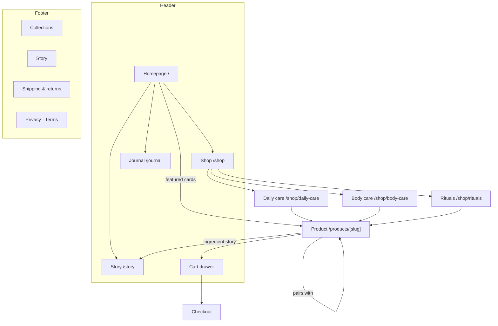

# VELA — information architecture

**Blueprint refs:** §4 (UX, IA & page map), §2 (scope), Phase 1

Site type: **e-commerce**, nine products, three collections, one editorial thread.
Deliberately shallow — with nine SKUs, depth is a cost with no benefit.

---

## 1. Page hierarchy

```
Homepage (/)
├── Shop (/shop)                          all nine products, filter + sort
│   ├── Daily care (/shop/daily-care)     3 products
│   ├── Body care (/shop/body-care)       3 products
│   └── Rituals (/shop/rituals)           3 sets
├── Product (/products/[slug])            9 pages — the only L2 detail template
├── Story (/story)                        why VELA exists, how it formulates
├── Journal (/journal)                    editorial index
│   └── Article (/journal/[slug])         Optional (§2) — index-only for MVP
├── Cart (/cart)                          server-rendered fallback for the drawer
└── Styleguide (/styleguide)              engineering surface, noindex
```

Maximum depth from the homepage to any product: **2 clicks** (Homepage → Shop →
Product), or **1** from a featured card. Comfortably inside the three-click rule.

### Why `/products/[slug]` is not nested under its collection

`/shop/daily-care/balance-cleanser` would encode a product's category into its URL. Products
move between collections — a cleanser that becomes part of a body ritual should not need
a redirect. Flat product URLs with a `category` field on the product is the standard
headless pattern and the one Shopify itself uses (`/products/handle`). Breadcrumbs still
show the collection, sourced from the product's `category`, so the user-facing hierarchy
is intact even though the URL is flat.

---

## 2. Visual sitemap



---

## 3. URL map

| Page | URL | Parent | Nav | Rendering | Priority |
| --- | --- | --- | --- | --- | --- |
| Homepage | `/` | — | Header (logo) | Static | High |
| Shop — all | `/shop` | Homepage | Header | Static | High |
| Daily care | `/shop/daily-care` | Shop | Header dropdown | Static (`generateStaticParams`) | High |
| Body care | `/shop/body-care` | Shop | Header dropdown | Static | High |
| Rituals | `/shop/rituals` | Shop | Header dropdown | Static | High |
| Product | `/products/[slug]` | Collection | — | Static, 9 params | High |
| Story | `/story` | Homepage | Header | Static | Medium |
| Journal | `/journal` | Homepage | Header | Static | Medium |
| Cart | `/cart` | — | Header icon | Dynamic | High |
| Styleguide | `/styleguide` | — | — | Static, `noindex` | — |
| 404 | `/not-found` | — | — | Static | — |

**URL rules enforced:** lowercase, hyphens, no trailing slash, no dates, no IDs,
no query parameters carrying content. Filter and sort state on `/shop` *does* live in the
query string (`?sort=price-asc&skin=dry`) — it is view state, not content, and it makes
a filtered view shareable. Filtered views are `noindex` to avoid thin duplicates of the
canonical collection page.

---

## 4. Navigation spec

### Header — 4 items plus cart

`VELA` (logo → `/`) · **Shop** ▾ · **Story** · **Journal** · `Cart (n)`

- **Shop** opens a small panel, not a mega menu: the three collections with a one-line
  description each, plus "All products". Three items do not need a grid.
- The cart is the only right-aligned element. It shows a count only when non-zero — an
  empty badge is noise.
- **Mobile:** a full-height sheet. Shop expands in place rather than pushing to a second
  screen; with three collections, a drill-down pattern costs a tap and buys nothing.
- The header is sticky, reduced in height after 80px of scroll, and hides on scroll-down /
  reveals on scroll-up **only above the `lg` breakpoint** — on mobile the persistent cart
  affordance is worth more than the vertical space.
- An announcement bar sits above the header on the homepage only: free shipping over
  ₹1,500. Dismissible, and the dismissal persists in `sessionStorage` for the session.

### Footer — four columns

| Shop | Learn | Help | VELA |
| --- | --- | --- | --- |
| All products | Story | Shipping & returns | Newsletter |
| Daily care | Journal | Contact | Instagram |
| Body care | Ingredients | FAQ | Privacy |
| Rituals | Refills | | Terms |

Links to `/shipping`, `/faq`, `/contact` and the legal pages resolve to anchored sections
on `/story` for the MVP rather than to stub pages. **A footer link that 404s is worse
than a footer link that does not exist** — this is tracked as an acceptance criterion,
not left to chance.

### Breadcrumbs

On collection and product pages only. The homepage and top-level pages do not need them.

```
Home  ›  Shop  ›  Daily care
Home  ›  Shop  ›  Daily care  ›  Balance Cleanser
```

Sourced from the product's `category` field, marked up with `BreadcrumbList` JSON-LD, and
every segment except the current page is a link.

---

## 5. Core user journey

```
Landing → Discover → Collection → Product → Learn → Add to cart → Upsell → Checkout
```

| Step | Surface | The one job | The measurable |
| --- | --- | --- | --- |
| Landing | Hero | Say what VELA is in one screen | Scroll past the fold |
| Discover | Featured products | Get into the shopping flow | Click into a PDP or collection |
| Collection | Grid + filter | Narrow nine to two or three | Click into a PDP |
| Product | Gallery + buy box | Answer "will this suit me" | Variant selected |
| Learn | Ingredients, how it wears, not-for | Kill the "is this just packaging" doubt | Ingredient block expanded |
| Add to cart | Sticky buy area | Never lose the button | Add-to-cart |
| Upsell | Cart drawer, `pairsWith` | Raise AOV without a pop-up | Second line added |
| Checkout | Handoff | Get out of the way | Checkout started |

Two secondary journeys the IA must also serve:

- **Gift buyer** — lands on a set from search or a creator link, has never heard of VELA,
  and needs the brand argument *on the PDP* rather than a trip to `/story`. Every set PDP
  therefore carries a compact brand block.
- **Returning buyer** — knows the product name and wants it in under thirty seconds. Served
  by predictable product URLs and a cart drawer that never forces a page change.

**Motion rule inherited from §4.2:** every animation must support this journey. Motion that
exists only because a library can animate it is cut in review.

---

## 6. Internal linking plan

Hub-and-spoke, with `/shop` and `/story` as the two hubs.

| From | To | Link |
| --- | --- | --- |
| Homepage | 3 collections, 4 featured products, `/story`, latest journal card | Navigational + contextual |
| Collection | Its products, sibling collections, `/shop` | Breadcrumb + grid + sibling row |
| Product | 1–2 `pairsWith` products, its collection, ingredient section of `/story` | Contextual — never a "you may also like" dump |
| Story | The collections named in the text, the ritual sets | Contextual, in prose |
| Journal | Products named in each article | Contextual |
| Footer | Every collection, story, legal | Navigational |

**Orphan audit:** every one of the nine products is reachable from its collection page, from
`/shop`, and from at least one `pairsWith` on a sibling product. No page in the site has a
single inbound link.

Anchor text is descriptive — "the Barrier Cream it was formulated with", never "learn more".

---

## 7. Responsive breakpoints

Mobile-first. Five widths are designed; the rest are consequences.

| Token | Width | Designed for | Layout |
| --- | --- | --- | --- |
| — | **360px** | Floor. Explicitly in the §11 QA matrix, not a fallback | 1 column, 20px gutter |
| `xs` | 384px | Common Android | 1 column, 24px gutter |
| `sm` | 640px | Large phone / small tablet portrait | 2-column product grid |
| `md` | 768px | Tablet portrait | 2 columns, PDP still stacked |
| `lg` | 1024px | Tablet landscape / small laptop | 3-column grid, PDP splits to two columns, header nav replaces the sheet |
| `xl` | 1280px | Laptop | 3 columns, wider gutters |
| `2xl` | 1536px | Desktop | 4-column grid, capped at `--container-page` (1440px) |

**Rules**

- The design system is authored mobile-first; every utility without a prefix is the 360px
  case.
- Content is capped at 1440px. Beyond that the page gains margin, not columns — an
  editorial layout at 2560px full-bleed reads as a bug.
- The PDP switches from stacked to split at `lg`, not `md`: at 768px a two-column PDP gives
  the gallery too little room to be worth the split.
- Type is fluid via `clamp()`, so there is no breakpoint whose only job is font size.
- Touch targets are ≥44px at every width, including the desktop header.

---

## 8. SEO surface

| Page | Title pattern | Notes |
| --- | --- | --- |
| Home | `VELA — Modern rituals, engineered for everyday life` | |
| Collection | `{Collection} — VELA` | Collection description as the meta description |
| Product | `{Product} — VELA` | Meta description from `tagline` + first sentence |
| Story | `Story — VELA` | |

- `Product` JSON-LD on every PDP with price, availability and `AggregateRating` drawn from
  the same `reviewsSummary` the UI renders — never a second, more flattering set of numbers.
- `BreadcrumbList` JSON-LD on collection and product pages.
- `Organization` JSON-LD once, in the root layout.
- `sitemap.ts` and `robots.ts` generated from the same catalogue the pages render from, so
  the sitemap cannot drift from reality.
- Canonicals on filtered collection views point at the unfiltered collection.
- `/styleguide` is `noindex, nofollow`.
